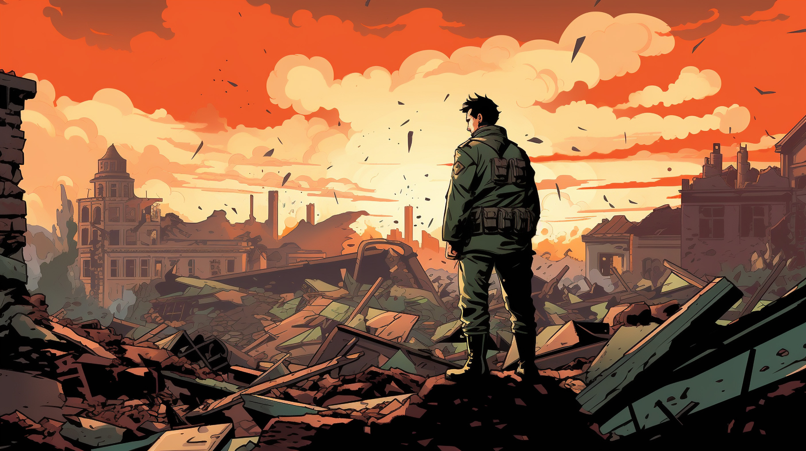

## The Enigma Challenge
I'm writing to bring to your immediate attention, As the sun dipped below the horizon last night, casting long shadows over the war-torn landscape, we launched a covert operation deep within enemy territory. The atmosphere was thick with tension, every heartbeat echoing the stakes of our mission. We had received chilling intel it seems the enemy is mobilizing for a significant tactical move—whispers of a looming Nazi offensive targeting an unknown city, but critical details eluded us. The time and location of the attack remained shrouded in mystery, and we were racing against the clock.

Tragically, the night revealed the true cost of our resolve. Our team faced fierce opposition, and amidst the chaos, we lost brave souls who believed in the fight for freedom. Their sacrifice weighs heavily on our hearts, urging us forward in our pursuit of the truth. We must not let their courage be in vain.

In the aftermath of the harrowing operation, we managed to intercept a vital piece of intelligence: an encrypted letter bound for high-ranking Nazi officials. This communication appears to have been encoded using the Enigma M3 model, a formidable tool of deception used by the enemy to shroud their plans in secrecy.

Now, we find ourselves at a crossroads. The intercepted letter contains the very details we need to countermeasures and thwart the impending attack, but the encryption holds us at bay. Our analysts believe that inside the letter lies the key to deciphering the time and location of the enemy’s operation, yet without the correct settings of the Enigma machine, it remains locked away, veiled in shadows.

Now, we turn to you, our trusted students. Your intellect and resilience are our greatest assets. We need your help to decode this intercepted letter. Hidden within are the Enigma settings that will reveal the enemy’s dark intentions and guide us in our response and may give us a strategic advantage.

You are asked to solve the puzzles of this number of Pardazeh Journal to find configurations of the Enigma M3 machine in the middle or at the end of them (or you can easily experience brute force...) Each puzzle revolves around cryptography, steganography, algorithms, and things for which I can't think of any category :)

The only way to ensure the authenticity of a decoded letter is that It ends with "Heil Hitler!".

Good luck!

Bernard Law Montgomery

 

Note: Although all the people and events have been tried to look real, none of them are real and were created with the help of ChatGPT.

To aid in your quest to decipher the intercepted letter, we recommend using the online Enigma machine simulation available at [Cryptii: Enigma Machine](https://cryptii.com/pipes/enigma-machine). This user-friendly tool allows you to experiment with various Enigma settings and provides an efficient way to test combinations as you work to unlock the secrets of the enemy’s communication. Remember, your ingenuity and resourcefulness are key to uncovering the truth and safeguarding the lives of many.

Will you rise to the challenge? The world is watching, and the lives of countless innocents depend on your ingenuity. The clock is ticking—let the decoding begin!
